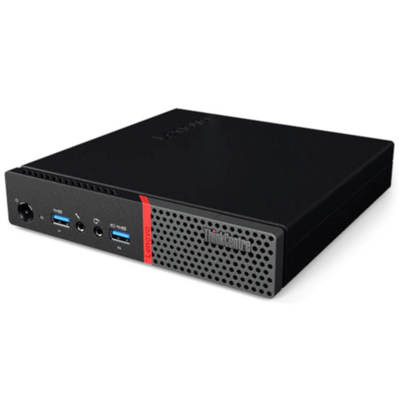

# homelab
This document describes my home lab environment utilizing VMware vSphere 7 for virtualization.
# Goals
I built this homelab for a few reasons. First off, it's like a giant playground for tech geeks! I can spin up virtual machines and try out all sorts of new products and technologies, which is great for learning.  Second, it helps me out at work.  By mimicking my customers' VMware setups, I can test things out and make sure everything works smoothly before they even see it.  Finally, this homelab is my training ground for certification exams like CNCF CKA/CKS, VMware VCP/VCAP, and Terraform. Basically, it's all about getting hands-on and leveling up my IT skills!
# Overview Diagram
The diagram below summarizes my Home Lab environment:

My home lab journey began with a focus on cost-effectiveness.  Leveraging a single cluster HomeLab with 3 ESXi hosts and vCenter Server deployed, I utilized refurbished mini workstations as hosts to keep hardware expenses low.

Within this initial environment, I established essential service VMs, including a Linux BIND DNS Server for internal DNS resolution and an OpenVPN Server for secure remote access.  This foundation provided a robust platform for deploying and testing various workloads, including Kubernetes clusters and Docker applications like Plex Media Server and NextCloud Server.

As my interest grew, I incorporated VMware NSX, Aria Operations, and Aria Operations for Logs to enhance my learning and simulate customer environments more accurately.  However, as the lab expanded, the need for remote storage became crucial for functionalities like VMware DRS/HA  to manage host resource utilization effectively.  To address this, I invested in a Synology NAS and configured it as an iSCSI target server, offering the necessary remote storage for the ESXi hosts.

The latest addition to my lab setup is a dedicated fourth ESXi host residing on a separate NestedVCF cluster.  This host is a Dell Workstation with beefier resources to handle a resource-intensive nested VMware Cloud Foundation (VCF) environment, further expanding my testing and learning capabilities.

Currently, I connect to my lab environment through my home network (192.168.1.0/24), which functions as the management network for the ESXi hosts and vCenter Server.  Furthermore, I have established isolated networks on separate VLANs within my 1 GB/s switch to cater to specific services. These include vMotion traffic, NSX overlay networks, and isolated networks for nested environments.  A detailed exploration of these additional network configurations is planned for a future write-up.

# Hardware

Below are the details of the hardware BOM I used in my home lab:

### Servers:

Model: HP EliteDesk 800 35W G2 ([vendor](https://support.hp.com/us-en/product/product-specs/hp-elitedesk-800-35w-g2-desktop-mini-pc/7633266))

Processor      : 1 x Intel(R) Core(TM) i5-6500T CPU @ 2.50GHz Processor

Memory         : 2 x 16GB DDR4 2133MHz

Hard Drive     : 1 x AGI 1TB AI198 Internal SSD, PCIe NVMe M.2 Gen3x4 SLC

Network        : 1 x RJ45 Ethernet (1Gbps) LOM, 1 x USB Ethernet Adapter (1Gbps)

Ports          : 1 x 2 USB 3.0 (Front), 1 x 4 USB 3.0 (Back)

Graphics       : 1 x Intel HD Graphics 520

---

Model          : Lenovo ThinkCentre M900 Tiny ([vendor](https://www.lenovo.com/gb/en/p/desktops/thinkcentre/m-series-tiny/m900-tiny/11tc1mtm900?orgRef=https%253A%252F%252Fwww.google.com%252F))

Processor      : 1 x Intel(R) Core(TM) i5-6500T CPU @ 2.50GHz Processor

Memory         : 2 x 32GB DDR4 2133MHz

Hard Drive     : 1 x AGI 1TB AI198 Internal SSD, PCIe NVMe M.2 Gen3x4 SLC

Network        : 1 x RJ45 Ethernet (1Gbps) LOM, 1 x USB Ethernet Adapter (1Gbps)

Ports          : 1 x 2 USB 3.0 (Front), 1 x 4 USB 3.0 (Back)

Graphics       : 1 x Intel HD Graphics 520

---

Model          : Dell Precision Tower 7810 ([vendor](https://www.dell.com/en-sg/shop/pcs-desktop-computers/dell-precision-tower-7810-workstation/spd/precision-t7810-workstation))

Processor      : 2 x Intel(R) Xeon(R) CPU E5-2697 v3 @ 2.60GHz Processor

Memory         : 8 x Kingston 32GB DDR4 PC4-2133P ECC

Hard Drive     : 1 x 1.6TB Intel P3605 NVMe SSD

Network        : 1 x RJ45 Ethernet (1Gbps) LOM, 4 x RJ45 Ethernet Adapter BCM5719 (1Gbps)

Ports          : 1 x 1 USB 3.0, 1 x 3USB 2.0 (Front), 1 x 3 USB 2.0, 1 x 3 USB 3.0 (Back)

Graphics       : 1 x NVIDIA Quadro M4000

---
#### **NOTES:
- For the HP & Lenovo Mini Workstations, I found that their AGI NVMe SSDs could not be recognized by ESXi 7. Upon researching this issue on the web, I discovered that with the update to ESXi 7, there is an issue relating to the NVMe 1.3 spec not conforming to the latest specification and hence the driver is unable to claim the device. Thankfully there is a workaround to resolve the issue which is to replace the NVMe driver from ESXi 7.0 with one found in ESXi 6.5 Update 2. For more details refer to this [page](https://williamlam.com/2019/05/quick-tip-crucial-nvme-ssd-not-recognized-by-esxi-6-7.html).
- As the workstations came with only a single RJ45 1Gbps LOM port, I decided to add a second USB 1Gbps Network Adapter to each of them (mainly due to reasons relating to NSX). In order for these USB adapters to be recognized by ESXi, I installed the [USB Native Driver Fling](https://www.virten.net/2020/09/tips-for-using-usb-network-adapters-with-vmware-esxi/) from the VMware community.

---
### Switch:

Model: TL-SG116E 16-Port Gigabit Easy Smart Switch ([vendor](https://www.tp-link.com/sg/business-networking/easy-smart-switch/tl-sg116e/))

---
### Storage:

Model: Synology NAS DS124 ([vendor](https://www.synology.com/en-us/products/DS124))

Disk:  Western Digital 8TB WD Red Plus NAS Internal Hard Drive HDD WD80EFZZ ([vendor](https://www.westerndigital.com/en-sg/products/internal-drives/wd-red-plus-sata-3-5-hdd?sku=WD80EFZZ))

# Software

Below are the details of the software BOM I used in my home lab:

- VMware ESXi 7.0 update 3g (build 20328353), & 7.0 update 3o (build 22348816)
- VMware vCenter Server 7.0 Update 3o (build 22357613)
- VMware NSX-T Data Center 3.2.3 (build 21703624)
- VMware Aria Operations 8.12.0 (build 21594884)
- Synology DSM 7.2-64570 Update 3

# Screenshots

Sceenshots showing my home lab environment can be found [here](https://github.com/Bryan-LJX/homelab/tree/main/homelab.screenshots.assets).

# Future 
### On Lab:
- To standardize ESXi versions across all hosts (not urgent as the Dell host on higher version is on separate cluster).
- Upgrade vSphere, NSX & Aria to the latest versions.
- Utilize more automation tools like Terraform, Ansible & PowerCLI to automate common & repetitive activities (eg. Deploy/configure VMs, Scale up/down, Power management etc.). 
### On GitHub:
- Write-up on network and VLAN configurations.
- Write-up on Nested VCF deployment.
- Configuration files of some of the esssential services (eg. BIND DNS Server, OpenVPN Server, pfSense Virtual Router etc.)
